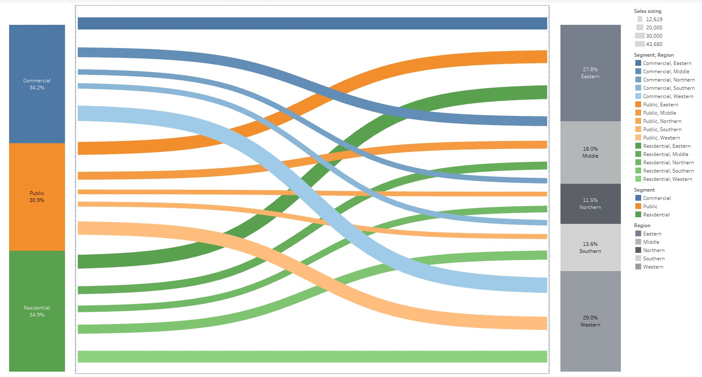

# Sankey-Chart
This project presents a Sankey Chart that visualizes the distribution of building types—Commercial, Public, and Residential—across five different regions: Eastern, Middle, Northern, Southern, and Western.

## 🧩 Overview

The purpose of this visualization is to understand how different building types are spread geographically. Each flow in the Sankey chart represents a proportion of a building type directed to a particular region, helping stakeholders analyze concentration and regional infrastructure trends at a glance.

## 📌 Key Features

- **No coding required** – Entirely built using Excel's data visualization capabilities.
- **Clear regional breakdown** for three major infrastructure categories.
- **Proportional flow thickness** indicates the relative volume of each building type per region.

## 🔍 Insights

- **Western** and **Eastern** regions have the largest share of infrastructure types.
- **Residential** infrastructure makes up the largest portion overall.
- The **Northern** region shows the lowest infrastructure flow, indicating potential for further development.

## 💼 Tools Used

- Microsoft Excel
- Excel Sankey Diagram (via built-in tools or chart add-ins)
- Optional: Screenshot/editing tools for exporting the final image

## 📷 Chart Preview

## 📥 How to Use

1. Open the Excel file `P27-African-Mobile-Data.xlsx`.
2. Review the sheet containing the raw data (building types by region).
3. Navigate to the Sankey chart tab (or recreate using add-in if not included).
4. Use the chart for reporting, presentations, or as a base for advanced data visualization in tools like Tableau or Python.

## 📬 Contact

Feel free to reach out if you'd like to collaborate, ask questions, or discuss more data visualization projects!

- 👤 **Dev Thakkar**
- 📫 [LinkedIn](https://www.linkedin.com/in/dev-thakkar-1b72851b1/) *(replace with your actual link)*

---

